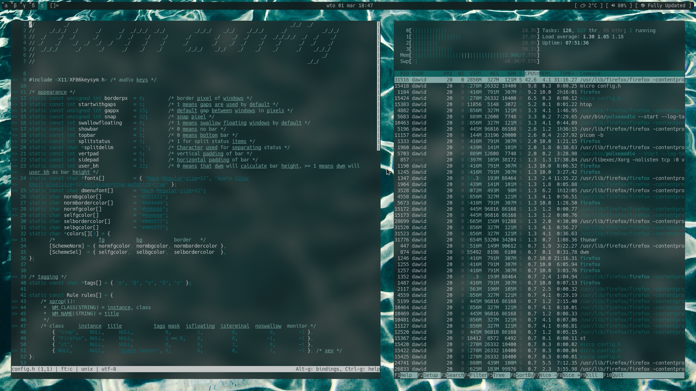

<h1 align="center"><b>dotfiles</b></h1>
 

<h2 align="center"><b>stuff I use</b></h2>

- window manager - [dwm](https://dwm.suckless.org/)
- color scheme - [pywal](https://github.com/dylanaraps/pywal) with [haishoku](https://github.com/LanceGin/haishoku) backend
- compositor - [jonaburg picom](https://github.com/jonaburg/picom)
- bar - [sbar](https://github.com/pystardust/sbar)
- run menu, power menu and screenshot utility - [dmenu](https://tools.suckless.org/dmenu/)
- terminal - [st](https://st.suckless.org/)
- shell - [zsh](http://en.wikipedia.org/wiki/Z_shell)
- text editor - [micro](https://micro-editor.github.io/)
- file manager - [ranger](https://github.com/ranger/ranger) and thunar

<h2 align="center"><b>gallery</b></h2>

